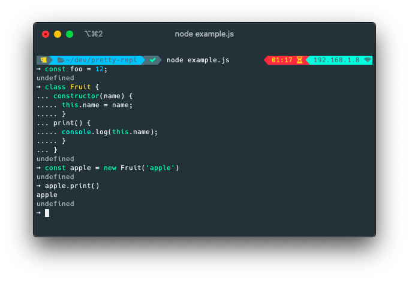

# Pretty REPL

An extension of the Node REPL (`repl.REPLServer`) that applies syntax highlighting as the user types.



## How to use it

Install the package:

```bash
$ npm install --save pretty-repl
```

Use the package:

```javascript
const PrettyREPLServer = require('.');

const options = {
    prompt: '→ '
};

new PrettyREPLServer(options);
```

`options` is an an object with the [same options](https://nodejs.org/api/repl.html#repl_repl_start_options) as `repl.REPLServer`.

Additionally, it's possible to pass an additional `colorize` property to the options object:

```javascript
{
    colorize: function (str) {
        // str is the the string in input.
        // the function should return the string that has been colorized to output in the REPL.
    }
}
```

## Known issues

* Only works properly on Node 13+. Unfortunately, Node 12 does some trickery when starting the REPL with `repl.start()`
  which makes it behave differently than when the REPL is started with `new repl.REPLServer()`. When `REPLServer` is instantiated
  directly, everyhting works fine until the REPL needs to throw an error. This is not true only for `FancyREPLServer`, it's the same
  also for the default `REPLServer` that ships with Node.

## Credits

Pretty repl is inspired and includes code fragments from:
* https://github.com/nodejs/repl
* https://github.com/aantthony/node-color-readline
